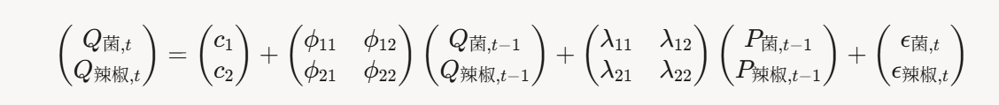

# Q2第一步思路

t为时间（按天计算），i为大品类（总共六类）
$$
P_i(t) = \frac{\sum\limits_{j \in \text{品类}i} p_j(t) \cdot q_j(t)}{\sum\limits_{j \in \text{品类}i} q_j(t)}
$$

$$
C_i(t) = \frac{\sum\limits_{j \in \text{品类}i} c_j(t) \cdot q_j(t)}{\sum\limits_{j \in \text{品类}i} q_j(t)}
$$


## Q2伪代码:先用ARIMA预测'2023-07-01', '2023-07-07'期间的需求

```python
import pandas as pd
import numpy as np
from statsmodels.tsa.arima.model import ARIMA
from scipy.optimize import minimize
from sklearn.linear_model import LinearRegression

# 假设sales_df: columns=['date', 'category', 'quantity', 'price']
# wholesale_df: ['date', 'category', 'wholesale_price']
# loss_df: ['category', 'loss_rate']

# 聚合到品类-日级
daily_sales = sales_df.groupby(['date', 'category']).agg({'quantity': 'sum', 'price': 'mean'}).reset_index()
daily_wholesale = wholesale_df.groupby(['date', 'category'])['wholesale_price'].mean().reset_index()
categories = daily_sales['category'].unique()  # 6个品类

demand_params = {}
for cat in categories:
    cat_data = daily_sales[daily_sales['category'] == cat]
    X = cat_data['price'].values.reshape(-1, 1)
    y = cat_data['quantity'].values
    reg = LinearRegression().fit(X, y)
    a, b = reg.intercept_, -reg.coef_[0]  # Q = a - b P
    demand_params[cat] = {'a': a, 'b': b}
    # 弹性计算: e = -b * (mean_P / mean_Q)

forecast_dates = pd.date_range('2023-07-01', '2023-07-07')
predictions = {}
for cat in categories:
    # 需求预测 (ARIMA on quantity, adjust for seasonality)
    ts_quantity = daily_sales[daily_sales['category'] == cat].set_index('date')['quantity']
    model_q = ARIMA(ts_quantity, order=(5,1,0), seasonal_order=(1,1,1,7)).fit()  # 示例order，需调参
    q_base_forecast = model_q.forecast(steps=7)

    # 批发价预测
    ts_wholesale = daily_wholesale[daily_wholesale['category'] == cat].set_index('date')['wholesale_price']
    model_c = ARIMA(ts_wholesale, order=(5,1,0)).fit()
    c_forecast = model_c.forecast(steps=7)

    L = loss_df[loss_df['category'] == cat]['loss_rate'].mean()
    predictions[cat] = {'q_base': q_base_forecast, 'c_pred': c_forecast, 'L': L}

```

# Q2第二步
## fit the linear demand model $ Q = a_i - b_i P $ for each category using historical sales data
This will provide the parameters $ a_i $ (intercept) and $ b_i $ (price sensitivity, slope) needed to compute the price-dependent demand $ Q_{\text{pred},i,j}(P) = Q_{\text{base},i,j} - b_i (P - P_{\text{avg},i}) $, which will be used for pricing and replenishment optimization in Problem 2 (category-level, no constraints). This step is critical to bridge your $ Q_{\text{base}} $ predictions to the optimization phase.

### Fit Linear Regression:

For each category $ i $, run linear regression $ Q \sim P $ to estimate:

$ a_i $: Intercept (baseline demand when $ P = 0 $).
$ b_i $: Slope (negative, as $ Q $ decreases with $ P $; we use $ b_i = -\text{slope} $).


Compute $ P_{\text{avg},i} $ (mean historical price) and $ Q_{\text{avg},i} $ (mean historical quantity) for later adjustment.


### Adjust Demand Function:

Use $ Q_{\text{base},i,j} $ to anchor the demand function:
$$Q_{\text{pred},i,j}(P) = Q_{\text{base},i,j} - b_i (P - P_{\text{avg},i})$$

This ensures the demand curve passes through $ (P_{\text{avg},i}, Q_{\text{base},i,j}) $.

### Prepare for Optimization:

Save the fitted parameters ($ a_i, b_i, P_{\text{avg},i} $) and merge with $ Q_{\text{base},i,j} $ for the next step (optimizing $ P $ and $ S $).


# Q2步骤3：优化模型（最大化收益）


决策变量：

对于每个品类i(i=1到6)、每天j (j=1到7，对应7/1-7/7)：

补货量$S_{i,j} ≥ 0$（单位：kg）。
定价$P_{i,j} ≥ C_{pred,i,j}$（避免亏损）。


目标函数（日收益最大化，一周总收益 = ∑_j 日收益）：
$$\max \sum_{i=1}^6 \sum_{j=1}^7 \left[ \min(S_{i,j} \times (1 - L_i), Q_{pred,i,j}(P_{i,j})) \times P_{i,j} - S_{i,j} \times C_{pred,i,j} \right]$$

解释：销售量 = min(可用量, 需求)，收入 = 销售 × P，成本 = 补货 × C。
未售出部分隐含损失（不产生收入，但有成本）。

最优解性质：在确定性假设下，最优$S_{i,j} = Q_{pred,i,j}(P_{i,j}) / (1 - L_i)$（补足损耗后正好匹配需求）。

简化目标为每个i,j独立优化：
$$\max_{P} Q(P) \times (P - C_{eff})$$

其中$C_{eff} = C_{pred} / (1 - L)$。


对于线性Q(P) = a - b P，解析解：
$$P^* = \frac{b P_{avg} + b C_{eff}+Q_{base}}{2b}, \quad Q^* = \frac{a - b C_{eff}}{2}, \quad S^* = \frac{Q^*}{1 - L}$$

这对应垄断定价公式，最大化边际收益。

## Q2步骤3伪代码
```python
results = []
for cat in categories:
    params = demand_params[cat]
    a, b = params['a'], params['b']
    for j in range(7):
        q_base = predictions[cat]['q_base'][j]
        c_pred = predictions[cat]['c_pred'][j]
        L = predictions[cat]['L']
        c_eff = c_pred / (1 - L)

        # 需求函数: Q(P) = q_base - b * (P - historical_avg_P)  # 调整基线，或直接用a - b P
        # 优化: max Q(P) * (P - c_eff)
        def objective(P):
            Q = a - b * P  # 或整合q_base
            return -(Q * (P - c_eff))  # minimize negative profit

        opt = minimize(objective, x0=[c_eff * 1.2], bounds=[(c_eff, None)])
        P_opt = opt.x[0]
        Q_opt = a - b * P_opt
        S_opt = Q_opt / (1 - L)

        results.append({'category': cat, 'date': forecast_dates[j], 'S': S_opt, 'P': P_opt})

results_df = pd.DataFrame(results)
# 输出results_df作为补货和定价策略
```

# 思路补充
## 考虑品类间的相关性，采用VAR（vector autoregression）模型
这种模型的思路和RNN，LSTM其实基本一致，都是引入了相关性的考虑
总体思路是先依靠Kmeans对所有大类的时间序列进行分组，这里考虑分成3个cluster，然后对每个大cluster之间进行VAR的QP推断

下面是gpt的转述

1. VAR模型在簇内的推断公式

假设Kmeans聚类结果将6个蔬菜品类分为3个簇（cluster），每个簇包含相关性较高的品类子集。例如，假设簇1包含“食用菌”和“辣椒类”两个品类（基于相关性聚类），我们使用VAR模型捕捉簇内品类销量Q之间的动态关系，同时考虑价格P作为外生变量（exogenous），以反映需求对价格的敏感性。这是一种VARX模型（VAR with exogenous variables）的简化形式，其中Q为内生向量（endogenous），P为外生向量。

对于滞阶p=1（简化假设，可通过信息准则如AIC扩展到更高阶），簇1的VARX(1)模型公式为：




其中：
- \( Q_{\text{菌}, t} \)：食用菌品类在时间t的销量。
- \( Q_{\text{辣椒}, t} \)：辣椒类品类在时间t的销量。
- \( c \)：常数向量（intercept）。
- \( \Phi = \begin{pmatrix} \phi_{11} & \phi_{12} \\ \phi_{21} & \phi_{22} \end{pmatrix} \)：内生滞后系数矩阵，捕捉Q间交叉影响（e.g., \phi_{12}表示辣椒滞后销量对食用菌当前销量的影响）。
- \( \Lambda = \begin{pmatrix} \lambda_{11} & \lambda_{12} \\ \lambda_{21} & \lambda_{22} \end{pmatrix} \)：外生系数矩阵，捕捉P滞后对Q的影响（e.g., \lambda_{12}表示辣椒滞后价格对食用菌当前销量的影响，通常\lambda<0，表示价格涨需求降）。
- \( \epsilon_t \)：残差向量，假设白噪声。

简化例子$Q_{菌t} = λ_1 * P_{菌{t-1}} + λ_2 * P_{辣椒{t-1}} + ε_t$

对于其他簇（如簇2有3个品类），公式类似扩展到更高维向量。

接下来更详细的说明在 VAR模型详述.md当中
