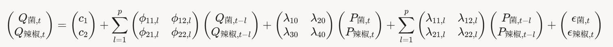

### 1. VAR模型推断公式（包含自动滞阶选择）

**目标**：在每个K-means簇（k=3）中使用VARX模型预测品类销量Q，同时引入滞后销量\(Q_{t-l}\)和滞后价格\(P_{t-l}\)作为外生变量。滞阶p通过AIC自动选择。

**簇1示例（食用菌和辣椒类）**：
VARX模型公式（滞阶p由AIC选择）：

- AIC选择p：\( \text{AIC} = 2k + n \ln(\det(\Sigma)) + 2p m (m + m_{\text{exog}}) \)。
- 预测Q_base：使用拟合VARX预测7天销量（假设未来P_t = P_avg）。

**需求函数（引入相关性）**：
对于品类i在簇c中，需求函数为：

\[
Q_{\text{pred},i,j}(\mathbf{P}_j) = Q_{\text{base},i,j} + \sum_{k \in c} \lambda_{ik,0} (P_{k,j} - P_{\text{avg},k})
\]

- \(Q_{base,i,j}\)：VARX在P_avg下的基线预测。
- \(\sum_{k \in c} \lambda_{ik,0} (P_{k,j} - P_{\text{avg},k})\)：引入簇内相关性（\(λ_{ii,0}\) < 0为自身价格敏感；\(λ_{ik,0}\) ≠ 0为交叉价格影响）。

其他簇类似扩展到m维。

### 2. 最优化模型

使用VAR预测的Q_base,i,j和相关需求函数优化定价P和补货S。

#### 问题2：品类级优化（无约束）
**目标**：最大化7天总收益（引入簇内相关性，按簇联合优化）：

\[
\max_{\{\mathbf{P}_{c,j}\}} \sum_{c=1}^3 \sum_{j=1}^7 \sum_{i \in c} \Pi_{i,j} = \sum_{c=1}^3 \sum_{j=1}^7 \sum_{i \in c} \left[ Q_{\text{base},i,j} + \sum_{k \in c} \lambda_{ik,0} (P_{k,j} - P_{\text{avg},k}) \right] \cdot (P_{i,j} - C_{\text{eff},i,j})
\]

- 约束：P_i,j ≥ C_eff,i,j；Q_pred,i,j ≥ 0。
- 补货：S_i,j = Q_pred,i,j / (1 - L_i)。
- 求解：簇内联合数值优化（梯度下降），解析近似若忽略交叉项。

#### 问题3：单品级优化（有约束）
**目标**：最大化7月1日收益（分摊Q_base到单品，引入簇内相关）：

\[
\max_{\{x_k, P_k\}} \sum_{k=1}^K x_k \cdot \left[ Q_{\text{base},k,j} + \sum_{m \in c_k} \lambda_{km,0} (P_{m,j} - P_{\text{avg},m}) \right] \cdot (P_k - C_{\text{eff},k})
\]

- 约束：x_k ∈ {0,1}；27 ≤ sum x_k ≤ 33；S_k ≥ 2.5 x_k (S_k = Q_pred,k,j / (1 - L_k))；P_k ≥ C_eff,k。
- 软约束：罚项 ω | sum_{k∈i} Q_pred,k,j - Q_base,i,j |。
- 求解：遗传算法（GA）处理MINLP，适应度 = sum Π_k - 罚项。